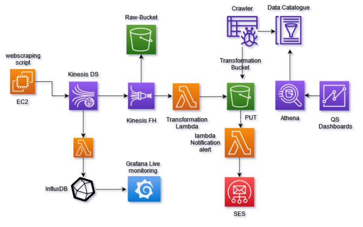

# MyStockTracker

# Overview
In this portfolio project, a highly optimized and efficient system has been designed using cutting-edge AWS technologies to scrape and process real-time stock data in an asynchronous manner. 
  

 - An EC2 instance has been configured to handle the high volume of data and seamlessly stream it to Kinesis Datastream using the AWS SDK for Python.

 - The data is then send to kinesis Datastream using aws  sdk for
   python.

 - To ensure data integrity and accuracy, a sophisticated Lambda function has been implemented to transform and validate the records before storing them in a time-series database. In addition, a Firehose stream has been configured to batch the raw data and efficiently store it in an S3 bucket.

 - To further optimize data processing and analysis, a Transformer Lambda function has been implemented to convert the data from JSON to Parquet format with dynamic partitioning, which not only provides faster querying but also ensures data integrity.

 - Moreover, a Notification Lambda function has been integrated to monitor stock price fluctuations and notify users via email if any stock has increased or decreased by 1%.

 - Finally, a Glue Crawler has been utilized to make the data available for further analysis and visualization using powerful tools such as Athena and Quicksight, enabling users to gain valuable insights into the stock market trends and make informed investment decisions.

# What makes this project unique

This portfolio project showcases a secure, scalable, and reliable solution that follows best practices in software development and infrastructure deployment. It adheres to SOLID principles and implements IaaC to allow easy deployment across regions and accounts. A comprehensive guide explains the selection of services, such as InfluxDB, for optimal performance and flexibility.

# _Realtime ETL pipeline_

## Extraction

- As no free stock API service met the project's requirements, an expertly designed web scraper was deployed on an EC2 instance that operates continuously and streams the data directly to Kinesis Datastream using the AWS SDK.
The scraper uses aws sdk to deliver the data directly to kinesis Datastream.

## Transformation
- To ensure data accuracy and consistency, a powerful Lambda function has been integrated that triggers the necessary transformations as soon as records are put into Kinesis Datastream.

## Load

- The ideal choice for the database was a timeseries database, and InfluxDB was selected due to its exceptional features and open-source nature. The same powerful Transformation Lambda function was utilized to seamlessly load the data into InfluxDB while maintaining data integrity.

Overall, this project showcases a high-performance, end-to-end solution for real-time data extraction, transformation, and loading, leveraging cutting-edge technologies and expert design for exceptional results.

# Realtime visualizations

Grafana, with its advanced visualization capabilities and real-time alerting services, has been selected to monitor and visualize stock data, providing an exceptional user experience and superior data insights.

# Batch processing

 - This portfolio project features a Firehose stream, which serves as a high-performance buffer for Kinesis Datastream, dynamically partitioning data by date and stock name.

 - To ensure optimal data integrity and compatibility, an expertly designed Lambda function is triggered every time an object is put into the raw bucket, seamlessly converting the file type from JSON to Parquet.

 - The transformed data is then securely stored in a separate S3 bucket, ready for analysis using Athena and QS, with a powerful Glue crawler triggering daily for an exceptional analysis experience.

# Alerts and Notifications:

## Real-Time alerts

Grafana as a ready solution for alerting when a certain kpi has exceeded a specific threshold and this solution is the one used to realtime alert.

## Near real-time

A Lambda function is being triggered after a put event in the transformed bucket that checks for alerting conditions in the buffered data.

# Security Practices

 - The project features robust security measures, including VPN access from a specific IP address with proper certificates for accessing any EC2 instance.

 - IAM roles strictly adhere to the principle of least privilege, ensuring that user access is limited to the minimum necessary for performing essential tasks.

 - To ensure optimal security, EC2 profiles are used instead of saving configurations within the EC2 itself, ensuring that all access is strictly controlled and monitored at all times.

# CI/CD and IaaC

- Utilized Terraform to create and manage infrastructure resources, allowing for efficient and scalable deployment of
the pipeline.

- Incorporated CI/CD processes using GitLab to automate the pipeline’s testing, building, and deployment, reducing
the time-to-market for new features.

# Next steps: 

 - Enriching stock data with sentiment analysis from Twitter hashtags to analyze how sentiment affects stock prices.

 - Deploying and testing the efficiency of a backtrading bot to determine its real-world viability.

 - Enhancing the webscraper with multiple IP proxies to prevent bans and improve resilience.

 - Designing a disaster recovery plan to ensure the solution meets MTTR and point-in-time recovery requirements.

